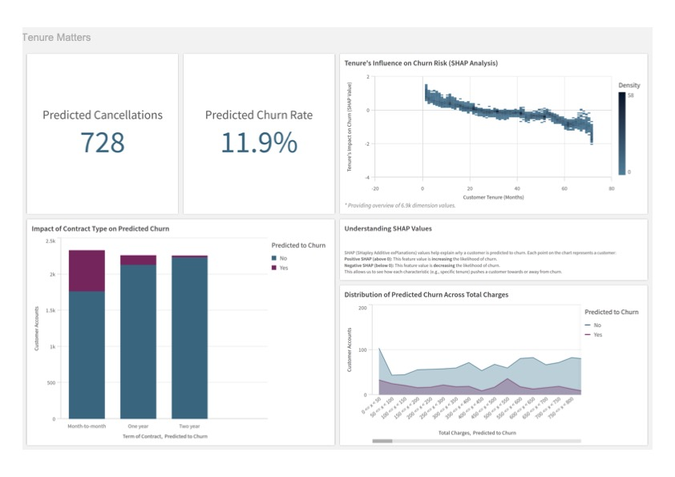

<link rel="icon" type="image/png" href="/favicon.png">

Welcome! I'm a data-driven problem solver with a passion for turning raw information into actionable business insights. This site showcases a collection of projects I've built across analytics, dashboarding, and data science.

---

## 🔍 Featured Projects

### [📊 Telecom Customer Churn Prediction Model & Visualization Project](projects/business/project-1-sales-analysis/)
**Tools:** SQL, Qlik Cloud Analytics

**Summary:** Leveraging data to proactively retain customers and drive business growth.  
This project demonstrates an end-to-end analytical approach to predict customer churn for a telecommunications company. I utilized MySQL for robust data cleaning and engineering insightful new features, then employed Qlik Cloud Analytics' ML capabilities to build and evaluate a predictive model. The resulting Qlik Sense dashboard provides interactive visualizations of key churn drivers and actionable insights, enabling targeted strategies to reduce customer churn and optimize retention efforts.

**A Snapshot of The Project**

  

### [📊 Supply Chain Performance & Bottleneck Analysis ](projects/business/project-2-supply-chain-analysis/)
**Tools:** Python, SQL, Qlik Cloud Analytics

**Summary:** This project focused on a comprehensive analysis of a simulated supply chain to identify and address operational inefficiencies. By starting with a small dataset and augmenting it to a more realistic size of over 10,000 rows using a Python script, the project demonstrated a strong foundation in data engineering. The data was meticulously cleaned and enhanced in MySQL with new features like Total_Cost, Total_Lead_Time, and a Cost_Category. The final insights were presented in a dynamic Qlik Sense dashboard, which visually highlighted a manufacturing bottleneck, exposed quality issues by product type and supplier, and analyzed the cost-time trade-offs of shipping carriers. The project successfully translated complex data into clear, actionable recommendations for improving overall supply chain performance.

**A Snapshot of The Project**

  

---

## 📂 Explore Projects by Category

🔗 [Business & Supply Chain Analytics](business/)

---

## 📄 Resume & Contact

📄 [Download My Resume (PDF)](assets/resume.pdf)  
🔗 [LinkedIn](https://www.linkedin.com/in/renniecrookston)  
📧 renniecrookston@gmail.com

---

Thanks for stopping by!

---

  <small>© 2025 Rennie Crookston | Built with GitHub Pages & Jekyll</small>

