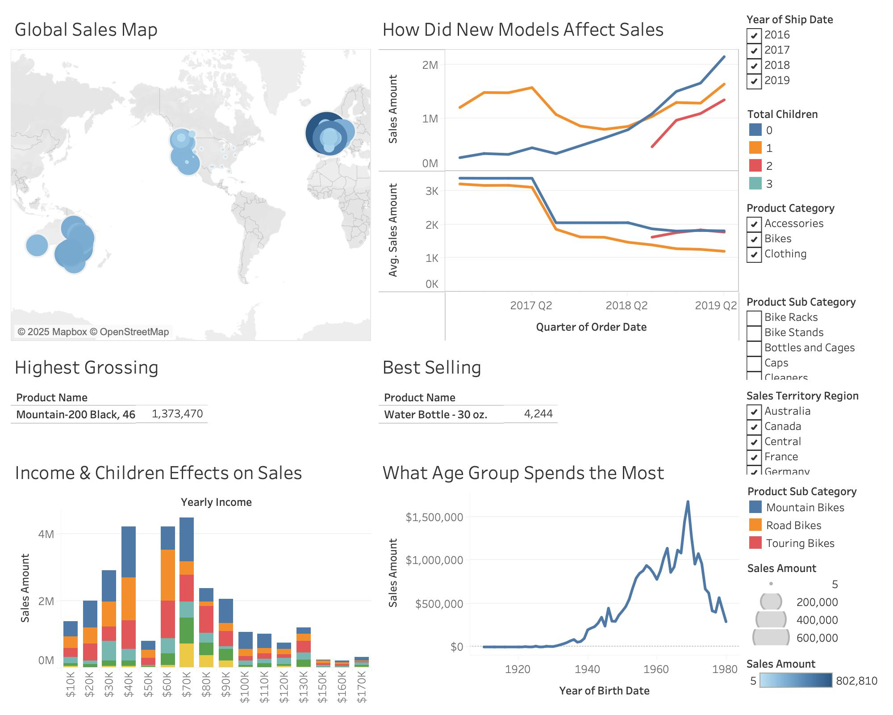

 # Rennie Crookston | Data & Business Analyst Portfolio

Welcome! I'm a data-driven problem solver with a passion for turning raw information into actionable business insights. This site showcases a collection of projects I've built across analytics, dashboarding, and data science.

---

## 🔍 Featured Projects

### 📊 Blank Sales Data Project
**Tools:** Tableau, Excel, SQL  
**Summary:** Placeholder dashboard analyzing product mix and key demographics. Demonstrates visualization and storytelling skills across multiple variables.  
📸 

---

## 📄 Resume & Contact

📄 [Download My Resume (PDF)](assets/resume.pdf)  
🔗 [LinkedIn](https://www.linkedin.com/in/renniecrookston)  
📧 renniecrookston@gmail.com

---

## 📚 Blog (Coming Soon)
- How I Built a Sales Dashboard in Tableau
- SQL for Business Analysts: Real-World Use Cases
- From Raw Data to Dashboard: A Beginner's Journey

Thanks for stopping by!
